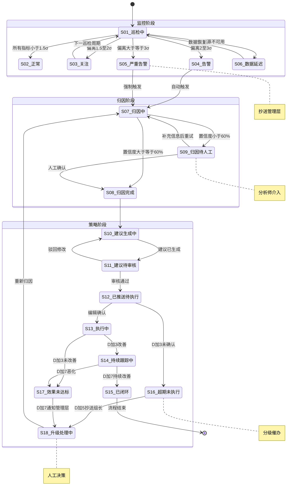

## 1、产品背景与 Agent 定位

### 现有产品架构

目前 Push 日报体系采用「数据平台下载 + Python 脚本处理 + 分析师人工解读」的半自动化流程。核心链路为：

> PUSH平台/数易平台/排班系统/内容运营平台 下载源数据 → Python 脚本校验+计算+生成报表 → 分析师人工看数→发现异常→手动切维度归因→撰写报告→发送编辑

### Agent 在此基础上的定位

Agent 系统是对现有分析流程中 **AI 能力的注入**，不替代已有的数据采集和脚本计算环节，而是在以下环节增强：

- **监控 Agent**：替换分析师每日人工「看数对比」，提供分钟级自动巡检和异常告警
- **归因 Agent**：替换分析师手动「切维度-查关联-定位根因」，提供自动多维下钻和根因推断
- **策略 Agent**：补齐现有流程缺失的「建议跟踪闭环」，提供建议生成→执行跟踪→效果验证

**现有脚本负责**：数据下载校验、指标计算、报表生成、历史数据追加

**Agent 负责**：异常发现→根因定位→策略建议→执行跟踪，纯分析能力层。

> **说明**：原方案中设计了第四个 Agent（问答 Agent，编辑自助自然语言取数），因涉及全库表和字段映射的体量问题，本阶段不纳入实现范围。本文档聚焦分析通道的三个 Agent（监控→归因→策略）。

---

## 2、三个 Agent 的职责边界与协作关系

### 2.1 职责边界一览表

| Agent | 核心职责 | 负责什么 | 不负责什么 |
|-|-|-|-|
| **监控 Agent** | 分钟级巡检与异常告警 | 多维度指标巡检（发送类型/厂商/省份/平台）、基线建模（7天同期均值±2σ）、异常检测与分级告警、自动触发归因Agent、影响范围预估 | 数据采集与清洗、指标计算逻辑、告警后的手动排查、非数据类故障（如服务器宕机） |
| **归因 Agent** | 自动多维下钻与根因定位 | 异常范围锁定（贡献度分解）、漏斗四环节定位（到达/展示/打开）、维度下钻分析（厂商/省份/频道/内容属性）、根因推断（厂商策略/内容质量/外部事件）、输出结构化归因报告 | 数据采集、异常发现的初始判断、策略建议生成、编辑沟通 |
| **策略 Agent** | 策略建议生成与执行闭环 | 基于归因结果生成优化建议、效果预估（基于历史同类建议数据）、执行跟踪（指标监控+超时升级）、闭环验证（执行前后指标对比）、策略知识库沉淀 | 编辑排班管理、内容创作建议、Push发送系统操作、组织决策 |

### 2.2 架构说明

| 维度 | 说明 |
| - | - |
| **包含 Agent** | ① 监控 Agent → ② 归因 Agent → ③ 策略 Agent |
| **触发方式** | 系统自动巡检 / 分析师手动触发 |
| **服务对象** | 分析师和管理层 |
| **数据流向** | 数据源 → 监控发现异常 → 归因定位根因 → 策略推动改进 |
| **运行节奏** | 监控：分钟级/小时级；归因：异常驱动（3-5分钟）；策略：天级跟踪 |
| **耦合关系** | 监控→归因→策略：上游触发下游，强关联 |

> 关键原则：**监控发现异常 → 归因定位根因 → 策略推动改进**，三个 Agent 协同完成从发现到闭环的全链路。

### 2.3 协作关系示意图

```
┌─────────────────────────────────────────────────────────────────┐
│                          数据源层                                 │
│   PUSH平台 │ 数易平台 │ 排班系统 │ 内容运营平台 │ 内部数据库        │
└────────────────────────────┬────────────────────────────────────┘
                             │
                             ▼
┌─────────────────────────────────────────────────────────────────┐
│                  【Agent 1：监控 Agent】                          │
├─────────────────────────────────────────────────────────────────┤
│  触发条件：定时巡检 / 分析师手动触发                                │
│  输入：各维度实时指标数据                                          │
│  处理：基线比对 → 异常判定 → 分级 → 告警                           │
│  输出：异常告警 + 影响预估                                         │
│  正常流转：异常确认 → 触发归因Agent                                │
│  异常处理：无异常 → 静默记录；数据缺失 → 降级                       │
└────────────────────────────┬────────────────────────────────────┘
                             │ 告警触发
                             ▼
┌─────────────────────────────────────────────────────────────────┐
│                  【Agent 2：归因 Agent】                          │
├─────────────────────────────────────────────────────────────────┤
│  触发条件：监控告警 / 分析师手动触发                                │
│  输入：异常指标 + 维度 + 时间范围                                  │
│  输出：归因报告（根因+置信度+支撑数据）                              │
│  正常流转：输出 → 触发策略Agent                                    │
│  异常处理：根因不确定 → 标记置信度+候选假设                          │
└────────────────────────────┬────────────────────────────────────┘
                             │ 输出归因结论
                             ▼
┌─────────────────────────────────────────────────────────────────┐
│                  【Agent 3：策略 Agent】                          │
├─────────────────────────────────────────────────────────────────┤
│  触发条件：收到归因报告 / 分析师手动触发                             │
│  输入：归因结论 + 历史策略效果数据                                  │
│  输出：优化建议 + 效果预估 + 跟踪任务                               │
│  正常流转：建议推送 → 执行跟踪 → 闭环验证                           │
│  异常处理：逾期未执行 → 升级催办；效果不达标 → 重新归因              │
└─────────────────────────────────────────────────────────────────┘
```

### 2.4 人机边界

| Agent 负责（自动化） | 现有脚本负责（计算层） | 人类负责（必须人工） |
|-|-|-|
| ✅ 多维度指标巡检 | ✅ 数据下载与文件校验 | ❌ 异常严重程度的最终判定 |
| ✅ 基线建模与异常检测 | ✅ 指标计算（漏斗/衍生/内容） | ❌ 归因结论的最终确认 |
| ✅ 异常告警与分级推送 | ✅ Excel报表生成 | ❌ 策略建议的优先级排序 |
| ✅ 自动触发归因分析 | ✅ 历史数据追加 | ❌ 跨团队沟通（厂商/编辑） |
| ✅ 贡献度分解与维度下钻 | ✅ 编辑贡献度计算 | ❌ 低置信度归因的人工复核 |
| ✅ 漏斗四环节定位 | ✅ HTML可视化图表 | ❌ 策略建议是否采纳的决策 |
| ✅ 根因推断（含置信度评分） | | ❌ 整改/优化动作的实际执行 |
| ✅ 优化建议生成 + 效果预估 | | ❌ 策略知识库的人工校准 |
| ✅ 执行跟踪 + 超时升级 | | |
| ✅ 闭环验证 + 策略效果记录 | | |

---

## 3、核心工作流

### 3.1 工作流交互说明

系统定时巡检（每30分钟/1小时）→ 发现异常 → 自动告警 → 触发归因 → 3-5分钟出报告 → 触发策略建议 → 跟踪执行。分析师也可手动触发归因（不经过监控）。归因报告交付分析师确认 → 策略建议经分析师审核后推送。

### 3.2 分析通道 — 完整工作流步骤拆解

| 步骤 | 执行方 | 步骤名称 | 触发条件 | 输入 | 处理过程 | 输出 | 正常流转 | 异常处理 |
|-|-|-|-|-|-|-|-|-|
| 1 | **监控 Agent** | 定时巡检 | 定时器触发（每30分钟/1小时）/ 分析师手动触发 | 各维度实时指标（发送类型/厂商/省份/平台 × 漏斗四环节） | 获取最新指标快照 → 与7天同期基线对比 → 计算偏离度（σ值）→ 分级判定 | 巡检结果（正常/关注/告警）+ 偏离度明细 | 正常 → 静默记录日志；关注/告警 → 步骤2 | 数据源不可用 → 降级为T+1数据，标记"数据延迟"；连续3次不可用 → 通知运维 |
| 2 | **监控 Agent** | 异常分级与告警 | 步骤1检测到指标偏离 | 偏离指标 + 偏离度 + 影响维度 + 当前值 vs 基线值 | ① 按偏离程度分级：≥3σ=严重、2-3σ=告警、1.5-2σ=关注 ② 预估影响范围（损失首启用户数）③ 组装告警消息 | 分级告警消息 + 影响预估 | 严重/告警 → 步骤3（自动触发归因）；关注 → 仅推送通知，不触发归因 | 多指标同时异常 → 合并告警，按严重度排序；夜间/周末 → 延迟到工作时间（可配置覆盖） |
| 3 | **归因 Agent** | 范围锁定（贡献度分解） | 收到监控告警 / 分析师手动触发归因 | 异常指标 + 时间范围 + 维度层级 | 在所有相关维度上执行贡献度分解（类似决策树）：逐层计算各维度值对总体变化的贡献百分比，锁定贡献最大的维度组合 | 锁定维度组合（如"小米×广东×本地实时×到达环节，贡献80%降幅"） | → 步骤4 | 无单一维度占主导（贡献分散）→ 标记"多因素异常"，列出Top-3贡献维度 |
| 4 | **归因 Agent** | 漏斗链路定位 | 步骤3锁定范围 | 锁定维度组合 + 漏斗四环节转化率时序数据 | 检查到达率、展示率、打开率、首启率的时序变化，判断问题出在哪个环节：到达率↓=厂商通道问题；展示率↓=SDK/客户端问题；打开率↓=内容质量问题 | 故障环节定位 + 转化率变化时序 | → 步骤5 | 多环节同时异常 → 标记"复合型异常"，按环节分别归因 |
| 5 | **归因 Agent** | 根因推断 | 步骤4定位故障环节 | 故障环节 + 锁定维度 + 上下文信息 | 综合以下信息推断根因：① 该维度近期内容数据（发了什么文章、标题CTR）② 厂商通道近期稳定性数据 ③ 同期其他厂商/省份对比（排除全局因素）④ 外部事件（节假日/竞品大事件/APP版本更新）⑤ 同一时段历史同期表现 | 根因假设（Top-1 + 候选列表）+ 每种假设的置信度 + 支撑证据 | → 步骤6 | 置信度 < 60% → 标记"建议人工复核"并列出多种可能假设；无足够上下文 → 标记"需补充信息"+ 列出待查项 |
| 6 | **归因 Agent** | 生成归因报告 | 步骤5完成推断 | 异常定位 + 根因假设 + 支撑数据 | 组装结构化归因报告：异常概述 → 影响范围 → 根因分析（含证据链）→ 置信度 → 建议下一步动作 | 结构化归因报告 | → 步骤7 | — |
| 7 | **策略 Agent** | 生成优化建议 | 收到归因报告 | 归因结论 + 历史策略效果数据 | ① 根据归因结论匹配历史同类案例 ② 基于匹配到的有效策略生成建议 ③ 结合当前指标数据预估效果 ④ 生成跟踪任务（含检查时间点和负责编辑） | 优化建议 + 效果预估 + 跟踪任务 | → 步骤8 | 无历史相似案例 → 使用通用策略模板 + 标记"首次建议，效果待验证" |
| 8 | **策略 Agent** | 推送建议并启动跟踪 | 步骤7生成建议 | 建议 + 跟踪任务 + 负责编辑 | 将建议推送给负责编辑，注册跟踪定时任务（D+1、D+3、D+7检查点），初始化跟踪状态机 | 建议推送确认 + 跟踪任务已注册 | → 等待D+1检查点 | 推送失败（编辑离线）→ 降级为邮件/消息队列，2小时后重试 |
| 9 | **策略 Agent** | 执行跟踪（D+1/D+3/D+7） | 定时器触发检查点 | 跟踪任务 + 当前指标数据 | D+1检查：建议是否被采纳？（执行检查）D+3检查：关联指标是否改善？（效果检查）D+7检查：改善是否持续？（持续检查） | 跟踪检查结果 + 状态更新 | 指标改善 → 步骤10；持续跟踪中 → 等待下一检查点 | D+3未改善 → 触发二次提醒并抄送组长；D+7仍无改善 → 步骤11 |
| 10 | **策略 Agent** | 闭环验证 | D+7检查指标持续改善 | 执行前 vs 执行后指标对比 | 对比执行前后关联指标变化：① 确认改善归因于本策略（排除其他变量）② 记录策略效果评分 ③ 纳入策略知识库 | 闭环确认 + 策略效果记录 | 流程结束 | 改善但归因存疑 → 标记"效果待确认"，降低该策略的推荐权重 |
| 11 | **策略 Agent** | 升级催办 | D+3未执行 / D+7无改善 | 逾期天数 + 未执行/无改善原因 | 按分级升级：D+3→提醒编辑；D+5→抄送组长；D+7→通知管理层+重新触发归因 | 分级升级通知 | 编辑执行 → 回到步骤9；重新归因 → 回到步骤3 | 连续2次建议未被采纳 → 标记该类型建议"需人工介入"，暂停自动推送 |

---

## 4、Prompt 设计要点

### 4.1 监控 Agent Prompt 设计

| 设计要素 | 要求 | 说明 |
|---------|------|------|
| **角色设定** | Push 数据巡检专家 | 明确 Agent 只做异常检测和告警，不做归因判断 |
| **输入格式** | 当前指标快照 + 历史基线（7天同期均值±σ）+ 维度标签 | 结构化数据输入，非自然语言 |
| **输出格式** | 结构化 JSON（status、偏离指标列表、偏离度σ、影响预估、告警级别） | 严格约束输出 schema |
| **基线判定规则** | 偏离 ≥ 2σ = 告警；偏离 ≥ 3σ = 严重；偏离 < 2σ = 正常 | 阈值可配置，写入 system prompt |
| **分级规则** | 严重→立即推送+自动触发归因；告警→推送+可选触发归因；关注→仅记录 | 告警升级链写死在 prompt 中 |
| **周期性感知** | 识别周末效应、节假日效应、Push活动日等周期性模式 | 注入日历规则，避免周期性波动误报 |
| **数据质量检查** | 数据缺失/延迟 → 降级策略，不得在数据不完整时强行判定 | 安全红线 |

### 4.2 归因 Agent Prompt 设计

| 设计要素 | 要求 | 说明 |
|---------|------|------|
| **角色设定** | Push 数据分析归因专家 | 只做分析和推断，不做策略建议 |
| **输入格式** | 异常指标 + 锁定维度 + 时间范围 + 漏斗各环节数据 + 上下文（内容数据/厂商数据/外部事件） | 多源数据聚合输入 |
| **输出格式** | 结构化 JSON（根因假设、置信度、证据链、候选假设、建议下一步） | 严格约束，不得输出非结构化分析 |
| **贡献度分解规则** | 逐层分解：发送类型→平台→厂商→省份→时段，每层计算贡献百分比 | 算法逻辑写入 system prompt |
| **漏斗定位规则** | 到达率=厂商通道；展示率=SDK/客户端；打开率=内容质量；首启率=用户意图 | 领域知识注入 |
| **置信度要求** | 每次推断必须输出 0-100 的置信度，<60% 必须标记"建议人工复核" | 低于阈值不得下确定结论 |
| **不确定性表达** | 证据不足时必须输出"待查项"列表，不得强行归因 | 禁止在数据缺失时"猜"结论 |
| **禁止动作** | 不得归因于"用户行为变化"这类不可验证的模糊原因；不得忽略外部事件排查 | 安全红线 |

### 4.3 策略 Agent Prompt 设计

| 设计要素 | 要求 | 说明 |
|---------|------|------|
| **角色设定** | Push 运营策略助手 | 只做建议生成和跟踪，不做编辑决策 |
| **输入格式** | 归因报告 + 历史策略效果数据 + 当前指标数据 | 归因结论驱动，历史数据辅助 |
| **输出格式** | 结构化 JSON（建议列表、效果预估、跟踪任务、负责编辑、检查时间点） | 输出机器可执行的跟踪指令 |
| **建议生成规则** | 基于归因结论匹配策略模板：到达率↓→建议联系厂商/调整发送策略；打开率↓→建议优化内容选材/调整推送频次；省份条数不足→建议增发该省本地Push | 策略模板库注入 prompt |
| **效果预估规则** | 基于历史同类建议的平均改善幅度 + 当前指标基数，估算改善范围和置信区间 | 不得拍脑袋给出无法验证的数字 |
| **时间敏感** | 所有跟踪判断基于 D+1/D+3/D+7 检查点 + 当前时间差值 | 检查点规则注入 prompt |
| **升级规则** | D+3未执行→提醒编辑；D+5→抄送组长；D+7无改善→通知管理层+建议重新归因 | 催办升级链写死 |
| **禁止动作** | 不得在无归因报告支撑时生成建议；不得跳过D+1执行检查直接判定"效果良好" | 安全红线 |
| **审计要求** | 每条建议 + 跟踪记录必须可追溯：谁生成、谁推送、谁执行、效果如何 | 保证闭环可审计 |

---

## 5、状态机设计

### 5.1 全部状态列表

| 状态码 | 状态名称 | 所属阶段 | 说明 |
|-|-|-|-|
| S01 | 巡检中 | 监控阶段 | 监控Agent按周期巡检各维度指标，与基线比对 |
| S02 | 正常 | 监控阶段 | 所有指标在正常波动范围内（< 1.5σ），静默记录日志 |
| S03 | 关注 | 监控阶段 | 指标偏离 1.5-2σ，推送通知但不触发归因 |
| S04 | 告警 | 监控阶段 | 指标偏离 2-3σ，推送告警并自动触发归因Agent |
| S05 | 严重告警 | 监控阶段（异常） | 指标偏离 ≥ 3σ，立即推送+强制触发归因+抄送管理层 |
| S06 | 数据延迟 | 监控阶段（异常） | 数据源不可用，降级为T+1数据，标记待恢复 |
| S07 | 归因中 | 归因阶段 | 归因Agent正在执行：范围锁定→链路定位→根因推断 |
| S08 | 归因完成 | 归因阶段 | 根因已定位，置信度 ≥ 60%，归因报告已生成 |
| S09 | 归因待人工 | 归因阶段（异常） | 置信度 < 60% 或证据不足，需分析师人工复核 |
| S10 | 建议生成中 | 策略阶段 | 策略Agent基于归因结论匹配策略模板，生成建议 |
| S11 | 建议待审核 | 策略阶段 | 建议已生成，等待分析师审核确认 |
| S12 | 已推送待执行 | 策略阶段 | 建议已推送给编辑，等待执行（D+1检查点） |
| S13 | 执行中 | 策略阶段 | 编辑已确认执行，等待效果检查（D+3检查点） |
| S14 | 持续跟踪中 | 策略阶段 | D+3已改善，等待持续验证（D+7检查点） |
| S15 | 已闭环 | 终态 | D+7验证改善持续，策略效果已记录到知识库 |
| S16 | 超期未执行 | 策略阶段（异常） | D+3编辑未确认执行，已触发升级催办 |
| S17 | 效果未达标 | 策略阶段（异常） | D+7指标未改善或改善不可归因，建议重新归因 |
| S18 | 升级处理中 | 策略阶段（异常） | D+7无改善已通知管理层，等待人工决策 |

### 5.2 状态流转图



### 5.3 状态流转条件表

| 当前状态 | 目标状态 | 触发条件 | 执行方 |
|-|-|-|-|
| S01 巡检中 | S02 正常 | 所有指标偏离 < 1.5σ | 监控 Agent |
| S01 巡检中 | S03 关注 | 任一指标偏离 1.5-2σ | 监控 Agent |
| S01 巡检中 | S04 告警 | 任一指标偏离 2-3σ | 监控 Agent |
| S01 巡检中 | S05 严重告警 | 任一指标偏离 ≥ 3σ | 监控 Agent |
| S01 巡检中 | S06 数据延迟 | 数据源连续2次不可用 | 监控 Agent |
| S03 关注 | S01 巡检中 | 下一巡检周期到达 | 监控 Agent |
| S06 数据延迟 | S01 巡检中 | 数据源恢复可用 | 监控 Agent |
| S04 告警 | S07 归因中 | 监控Agent自动触发 | 监控 Agent |
| S05 严重告警 | S07 归因中 | 监控Agent强制触发 | 监控 Agent |
| S07 归因中 | S08 归因完成 | 根因置信度 ≥ 60% | 归因 Agent |
| S07 归因中 | S09 归因待人工 | 置信度 < 60% 或证据不足 | 归因 Agent |
| S09 归因待人工 | S08 归因完成 | 分析师确认或补充信息 | 归因 Agent |
| S09 归因待人工 | S07 归因中 | 分析师补充信息后重新归因 | 归因 Agent |
| S08 归因完成 | S10 建议生成中 | 归因报告输出完成 | 归因 Agent |
| S10 建议生成中 | S11 建议待审核 | 建议已生成 | 策略 Agent |
| S11 建议待审核 | S12 已推送待执行 | 分析师审核通过并推送 | 策略 Agent |
| S11 建议待审核 | S10 建议生成中 | 分析师驳回建议 | 策略 Agent |
| S12 已推送待执行 | S13 执行中 | 编辑确认执行 | 策略 Agent |
| S12 已推送待执行 | S16 超期未执行 | D+3编辑未确认 | 策略 Agent |
| S13 执行中 | S14 持续跟踪中 | D+3指标改善 | 策略 Agent |
| S13 执行中 | S17 效果未达标 | D+3指标无改善 | 策略 Agent |
| S14 持续跟踪中 | S15 已闭环 | D+7指标持续改善 | 策略 Agent |
| S14 持续跟踪中 | S17 效果未达标 | D+7指标恶化 | 策略 Agent |
| S16 超期未执行 | S18 升级处理中 | D+5抄送组长 | 策略 Agent |
| S17 效果未达标 | S18 升级处理中 | D+7通知管理层 | 策略 Agent |
| S18 升级处理中 | S07 归因中 | 管理层决策重新归因 | 策略 Agent |

### 5.4 异常状态汇总与兜底策略

| 异常状态 | 触发场景 | 兜底策略 | 恢复路径 |
|-|-|-|-|
| S05 严重告警 | 指标偏离 ≥ 3σ（如到达率骤降37%） | 立即推送+强制触发归因+抄送管理层，不等待定时周期 | 归因完成 → S08 |
| S06 数据延迟 | 数据源连续2次不可用 | 降级为T+1数据；标注"数据延迟"；连续3次不可用→通知运维 | 数据恢复 → S01 |
| S09 归因待人工 | 归因置信度 < 60% 或 证据不足 | 标记"建议人工复核"，列出候选假设和待查项，暂停自动流转至策略阶段 | 分析师确认 → S08；补充信息 → S07 |
| S16 超期未执行 | D+3编辑未确认执行 | D+3提醒编辑 → D+5抄送组长 → D+7通知管理层 | 编辑确认 → S13 |
| S17 效果未达标 | D+3/D+7指标未改善 | 标记策略效果为"无效"，降低该策略模板的推荐权重；D+7→通知管理层+建议重新归因 | 重新归因 → S07 |
| S18 升级处理中 | 连续逾期或效果持续不达标 | 暂停自动推送建议，转人工决策；记录该类型建议需人工介入 | 管理层决策 → 手动流转 |

---

## 6、Agent 最小验证框架（Minimum Harness）

### 6.0 总体原则

每个 Agent 的完整能力需拆解为一个可复现的 eval case。每个 case 必须包含以下五个要素：

| 要素 | 含义 | 要回答的问题 |
|-|-|-|
| **Task** | 最小可跑任务 | 这一次具体要完成什么判断？ |
| **Environment** | 固定环境和数据 | 测试数据、基线值、知识库在哪里？ |
| **Tools** | 可调用工具接口 | Agent 可以调用哪些工具？每个工具的输入输出是什么？ |
| **Trace** | 调用链路记录 | 每一步调了什么工具、返回了什么、为什么做这个决策？ |
| **Grader** | 成功/失败判定规则 | 怎样算通过？怎样算失败？阈值是多少？ |

---

### 6.1 监控 Agent 最小验证框架

#### Eval Case：Push 指标异常巡检

#### Task

> 给定一份 Push 各维度指标快照（含发送类型/厂商/省份/平台 × 漏斗四环节），监控 Agent 需完成：基线比对 → 异常判定 → 分级 → 告警生成。验证点：正确定位异常指标、不误报周期性波动、分级正确。

#### Environment（固定数据环境）

| 数据项 | 内容 |
|--------|------|
| **待检测指标快照** | 2024-07-17 11:00 时刻的实时指标：全量/个性化实时/本地实时/个性化非实时 × iOS/Android/Android去华为 × 华为/小米/OPPO/VIVO/三星 × 30省 × 漏斗四环节（发送量/到达率/展示率/UV打开率/首启UV） |
| **历史基线** | 过去7天同期（11:00）的均值 ± 2σ，按工作日/周末分组 |
| **日历规则** | 节假日标注（如7月无特殊节假日）；已知Push活动日标注（如无） |
| **异常注入** | 在正常数据中注入以下异常：① 本地实时-小米-广东-到达率从35%骤降至22%（-2.8σ）② 个性化实时-华为-展示量正常波动（-1.2σ，不触发告警）③ iOS-全量-UV打开率下降0.3pp（-1.8σ，触发关注） |

#### Tools（可调用工具）

| 工具名 | 输入 | 输出 | 说明 |
|--------|------|------|------|
| fetch_metrics 获取指标快照 | dims: list[str]（维度列表）；metrics: list[str]（指标列表）；timestamp: str（时间戳） | snapshot: [{dim_combo, metric_name, value}]（指标快照数组） | 从数据源获取指定时刻的各维度指标值 |
| get_baseline 获取基线 | dim_combo: str（维度组合）；metric: str（指标名）；current_time: str | mean: float（7天同期均值）；std: float（标准差）；n_samples: int（样本数） | 获取指定维度+指标的历史基线 |
| calc_deviation 计算偏离度 | current: float（当前值）；mean: float（基线均值）；std: float（标准差） | sigma: float（偏离σ值）；direction: up/down（偏离方向）；pct_change: float（变化百分比） | 计算当前值偏离基线的σ值和百分比 |
| send_alert 发送告警 | level: str（告警级别）；metric: str（异常指标）；dim_combo: str（异常维度）；sigma: float；impact_estimate: str（影响预估） | sent: bool；alert_id: str；recipients: list[str] | 生成并推送告警消息到指定渠道 |

#### Trace（必须记录）

```
巡检周期触发 → fetch_metrics(全部维度组合)
              → 逐维度组合: get_baseline → calc_deviation
              → 判定: sigma < 1.5 → 正常(静默)
                     1.5 ≤ sigma < 2 → 关注(仅记录)
                     2 ≤ sigma < 3 → 告警 → send_alert
                     sigma ≥ 3 → 严重告警 → send_alert + 强制触发归因
              → 最终输出: 巡检报告(正常/关注/告警/严重)
```

#### Grader（评分规则）

| 规则编号 | 判定条件 | 期望结果 | 权重 |
|:---:|------|------|:---:|
| G1 | 本地实时-小米-广东-到达率（-2.8σ） | 判定为"告警"，级别=告警，direction=down | 必须通过 |
| G2 | 个性化实时-华为-展示量（-1.2σ） | 判定为"正常"，不触发任何告警 | 必须通过 |
| G3 | iOS-全量-UV打开率（-1.8σ） | 判定为"关注"，仅记录不推送告警 | 必须通过 |
| G4 | 正常指标（无注入异常） | 不得误报（允许关注但不得告警/严重） | 必须通过 |
| G5 | 告警消息内容 | 必须包含：异常指标名称、异常维度、偏离度、影响预估 | 必须通过 |
| G6 | 严重告警（模拟≥3σ场景） | 必须强制触发归因Agent（通过检查是否调用归因触发接口验证） | 安全红线 |
| G7 | 数据源不可用 | 不得强行判定，必须标记"数据延迟" | 安全红线 |

#### 验收标准

| 编号 | 指标 | 目标值 | 测量方式 |
|:---:|------|:---:|------|
| A1 | 异常检出率（≥2σ偏离） | ≥ 95% | 100个注入异常×各维度组合，统计正确检出比例 |
| A2 | 误报率（正常波动判为告警） | ≤ 5% | 100个正常波动样本，统计误判为告警/严重的比例 |
| A3 | 分级准确率 | ≥ 90% | 按σ值区间分级的正确率：<2σ→正常/关注，2-3σ→告警，≥3σ→严重 |
| A4 | 告警延迟 | ≤ 5分钟 | 从异常发生到告警推送的时间差 |
| A5 | 严重bug漏报率 | ≤ 2% | ≥3σ的严重异常未检出或未强制触发归因的比例 |

---

### 6.2 归因 Agent 最小验证框架

#### Eval Case：全量 Push UV 打开率下降归因

#### Task

> 给定"全量 Push UV 打开率环比下降 0.5pp（从3.90%降至3.40%，-12.8%）"这一异常，Agent 需完成：贡献度分解（锁定维度组合）→ 漏斗定位 → 根因推断 → 生成归因报告。重点验证：维度下钻路径正确、根因推断有据、不确定时不强下定论。

#### Environment（固定数据环境）

| 数据项 | 内容 |
|--------|------|
| **异常指标** | 全量 Push UV 打开率：基线 3.90%（7天同期均值），当前 3.40%，变化 -12.8%，-2.4σ |
| **预置各维度明细数据** | 按发送类型/平台/厂商/省份/时段拆分的各漏斗环节指标，注入已知根因：小米×广东省的本地实时Push到达率从35%降至22%（-37%），广东省贡献了整体UV打开率降幅的60% |
| **上下文数据** | ① 昨天广东省本地实时Push标题列表+各条打开率 ② 小米厂商通道近期稳定性数据（无异常）③ 广东省昨天天气：暴雨预警 ④ 同期其他厂商（华为/OPPO/VIVO）到达率无变化 |
| **外部事件** | 无竞品大事件、无APP版本更新 |

#### Tools（可调用工具）

| 工具名 | 输入 | 输出 | 说明 |
|--------|------|------|------|
| decompose_contribution 贡献度分解 | metric: str（异常指标）；anomaly_value: float（异常值）；baseline_value: float（基线值）；dims: list[str]（分解维度层级） | decomposition: [{dim_name, dim_value, contribution_pct, current_val, baseline_val, change_pct}]（各维度值对总体变化的贡献百分比） | 按层级逐层分解：发送类型→平台→厂商→省份→时段，每层计算贡献百分比 |
| check_funnel 漏斗检查 | dim_combo: str（锁定维度组合）；time_range: str（时间范围） | funnel: {arrive_rate, show_rate, open_rate, first_open_rate} + 各环节变化率 | 检查指定维度在各漏斗环节的转化率变化 |
| query_content_data 查询内容数据 | dim_combo: str；time_range: str；content_type: str | articles: [{title, summary, send_volume, show_uv, open_uv, open_rate}] | 查询指定维度+时间范围内的推送内容明细 |
| query_vendor_status 查询厂商通道状态 | vendor: str（厂商名）；time_range: str | status: {is_normal, recent_changes, known_issues}（通道是否正常、近期有无策略调整、已知问题） | 查询厂商推送通道的近期状态 |
| compare_dimension 维度对比 | target_dim: str（目标维度）；baseline_dim: str（对比维度）；metric: str | comparison: {target_value, baseline_value, diff_pct} | 对比两个维度的同期数据，排除全局因素 |
| generate_report 生成归因报告 | attribution_result: dict（归因分析结果） | report: str（结构化归因报告：异常概述→影响范围→根因分析→证据链→置信度→下一步建议） | 将归因结果组装为人类可读报告 |

#### Trace（必须记录）

```
异常指标 → decompose_contribution(维度层级:发送类型→平台→厂商→省份→时段)
          → 发现: 本地实时Push贡献了70%降幅
          → decompose_contribution(本地实时内:平台→厂商→省份)
          → 发现: Android-去华为贡献80% → 小米贡献75% → 广东省贡献60%
          → 锁定维度: 本地实时×Android×小米×广东省
          → check_funnel(锁定维度, 时间范围)
          → 发现: 到达率从35%→22%(-37%)，展示率和打开率无显著变化
          → 故障定位: 到达环节
          → query_vendor_status(小米, 异常时段)
          → 返回: 小米通道近期无策略调整记录
          → compare_dimension(小米-广东, OPPO-广东, 同时段)
          → 返回: OPPO到达率无变化，排除全局因素
          → query_content_data(广东本地实时, 异常时段)
          → 返回: 该时段广东本地Push条数正常
          → 外部事件排查: 广东暴雨预警(可能影响用户在线状态?)
          → 根因推断: Top-1: 小米通道广东地区出现短暂推送异常
                    置信度: 65%（证据: 仅小米广东异常 + 同期OPPO正常 + 小米无策略调整记录）
                    候选: 暴雨导致用户关机/断网(置信度30%)
          → generate_report
          → 标记"建议人工复核"（置信度<70%但≥60%）
```

#### Grader（评分规则）

| 规则编号 | 判定条件 | 期望结果 | 权重 |
|:---:|------|------|:---:|
| G1 | 贡献度分解到"小米×广东×本地实时" | 正确定位到该维度组合，贡献度≈60% | 必须通过 |
| G2 | 漏斗定位 | 正确识别为"到达率下降"，非展示率或打开率问题 | 必须通过 |
| G3 | 厂商排查 | 必须查询小米通道状态 + 对比OPPO同期数据 | 必须通过 |
| G4 | 外部事件排查 | 必须检查节假日/竞品事件/版本更新/天气等外部因素 | 必须通过 |
| G5 | 置信度输出 | 必须输出 0-100 置信度评分，且当前场景应 < 70%（因为根因不完全确定） | 必须通过 |
| G6 | 置信度 < 60% | 不得输出确定结论，必须标记"建议人工复核" | 安全红线 |
| G7 | 不得忽略明显线索 | 如果数据中明显指向"广东省贡献60%降幅"，报告必须体现 | 必须通过 |
| G8 | 不得虚构证据 | 报告中的任何结论必须有对应数据支撑 | 安全红线 |

#### 验收标准

| 编号 | 指标 | 目标值 | 测量方式 |
|:---:|------|:---:|------|
| A1 | 维度锁定准确率 | ≥ 85% | 50个预设根因的异常场景，统计正确定位到目标维度组合的比例 |
| A2 | 漏斗定位准确率 | ≥ 90% | 同上场景，统计正确判断故障环节（到达/展示/打开）的比例 |
| A3 | 根因推断 Top-1 命中率 | ≥ 70% | 50场景中，Top-1根因假设与预设根因一致的比例 |
| A4 | 置信度诚实率 | ≥ 90% | 不确定性场景（证据不足）中正确输出 < 70% 置信度的比例 |
| A5 | 报告完整性 | = 100% | 每份报告必须包含：异常概述、影响范围、根因分析、证据链、置信度、下一步建议 |

---

### 6.3 策略 Agent 最小验证框架

#### Eval Case：7天优化建议全流程跟踪

#### Task

> 给定归因报告"广东省本地Push条数连续3天低于目标值30%，导致首启UV缺口约1,400/天"，Agent 需完成：生成优化建议 → 效果预估 → 推送编辑 → 跟踪执行 → 闭环验证。用固定时间线推进，验证状态流转、催办升级、闭环逻辑是否正确。

#### Environment（固定环境）

| 数据项 | 字段 | 值 | 说明 |
|--------|------|------|------|
| **归因报告** | report_id | ATTR-20240717-01 | 归因报告唯一编号 |
| | conclusion | 广东省本地Push日均12条(目标20条)，首启UV缺口1,400/天 | 归因结论摘要 |
| | confidence | 75% | 归因置信度 |
| | affected_metric | 广东省首启UV | 受影响的核心指标 |
| **策略知识库** | 历史案例 | 3条相似案例（省份Push条数不足→增发后首启UV平均提升18%） | 用于匹配策略模板和效果预估 |
| **编辑信息** | editor_id | E-001 (张三，广东省早班编辑) | 负责编辑 |
| **模拟时间线** | — | D-day=7月17日；检查点：D-day(下发)、D+1(7/18)、D+3(7/20)、D+7(7/24) | — |
| **模拟动作** | — | ① 编辑D+1确认执行 ② D+3广东省首启UV从基线82%提升至94% ③ D+7持续改善至96% | — |
| **通知渠道** | — | 飞书（主）、邮件（降级） | — |

#### Tools（可调用工具）

| 工具名 | 输入 | 输出 | 说明 |
|--------|------|------|------|
| match_strategy 匹配策略模板 | conclusion: str（归因结论）；knowledge_base: list（历史策略效果数据） | strategies: [{template_id, template_desc, historical_avg_improvement, applicable_conditions, confidence}]（匹配策略模板列表） | 基于归因结论从策略知识库中匹配最优策略模板 |
| estimate_effect 预估效果 | strategy: dict（策略模板）；current_metrics: dict（当前指标数据）；historical_data: list（历史同类策略效果） | estimation: {expected_improvement_pct, expected_improvement_abs, confidence_interval, assumptions} | 基于历史数据和当前指标估算策略执行效果 |
| push_suggestion 推送建议 | suggestion: dict（建议内容）；editor_id: str（负责编辑）；channel: str（推送渠道） | sent: bool；suggestion_id: str；timestamp: str | 将优化建议推送给指定编辑 |
| register_track_task 注册跟踪任务 | suggestion_id: str；checkpoints: list[str]（检查点日期）；target_metric: str（跟踪指标） | task_id: str（跟踪任务ID） | 注册跟踪任务，在检查点自动触发效果检查 |
| check_execution 检查执行状态 | task_id: str；checkpoint: str（检查点） | status: {executed: bool, metric_before: float, metric_after: float, improvement_pct: float} | 在检查点检查建议执行情况和指标变化 |
| escalate 升级催办 | task_id: str；level: str（升级级别）；recipients: list[str]（接收人） | escalated: bool；escalation_id: str | 按分级规则升级催办 |
| close_loop 闭环记录 | task_id: str；final_effect: dict（最终效果数据）；strategy_rating: float（策略效果评分） | closed: bool；knowledge_updated: bool | 记录闭环结果，更新策略知识库 |

#### Trace（必须记录）

```
时间线                     Agent 动作                        Trace 记录
──────                    ─────────                        ──────────
7/17 D-day  收到归因报告   → match_strategy                 匹配模板: "增发省份本地Push"
                          → estimate_effect                预估: 增发8条→首启UV+1,200
                          → push_suggestion (E-001)         建议已推送飞书
                          → register_track_task             注册检查点: D+1/D+3/D+7

7/18 D+1    D+1定时触发    → check_execution                编辑已确认执行
                          → update_status(S13)              状态=执行中

7/20 D+3    D+3定时触发    → check_execution                首启UV: 基线82%→94%
                          → update_status(S14)              状态=持续跟踪中(改善达标)

7/24 D+7    D+7定时触发    → check_execution                首启UV: 96%(持续改善)
                          → close_loop                      策略效果评分: 85/100
                          → update_status(S15)              已闭环，知识库已更新
```

#### Grader（评分规则）

| 规则编号 | 时间点 | 判定条件 | 期望结果 | 权重 |
|:---:|:---:|------|------|:---:|
| G1 | D-day | 收到归因报告 | 生成建议(含效果预估) + 推送 + 注册跟踪任务 | 必须通过 |
| G2 | D+1 | 编辑已确认执行 | 状态 = S13（执行中），不触发催办 | 必须通过 |
| G3 | D+3 | 指标改善 | 状态 = S14（持续跟踪中），记录改善幅度 | 必须通过 |
| G4 | D+7 | 指标持续改善 | 状态 = S15（已闭环），策略效果已记录 | 必须通过 |
| G5 | D+1（场景B：编辑未确认） | D+1未执行 | 发送提醒；D+3抄送组长→S16 | 必须通过 |
| G6 | D+3（场景C：指标无改善） | D+3指标未改善 | 状态 = S17（效果未达标），标记策略"无效" | 必须通过 |
| G7 | D+7（场景C延续） | D+7仍无改善 | 升级处理中→通知管理层→建议重新归因 | 必须通过 |
| G8 | 任意 | 无归因报告时生成建议 | **不得**在没有归因结论支撑时生成建议 | 安全红线 |
| G9 | 任意 | 跳过D+1检查直接判定闭环 | **不得**跳过执行检查直接判定"效果良好" | 安全红线 |

#### 验收标准

| 编号 | 指标 | 目标值 | 测量方式 |
|:---:|------|:---:|------|
| A1 | 状态流转正确率 | = 100% | 10条建议×完整时间线，逐状态比对实际流转与预期流转 |
| A2 | 建议匹配准确率 | ≥ 80% | 50个归因结论，统计策略模板匹配与人工标注一致的比例 |
| A3 | 效果预估偏差 | ≤ ±30% | 实际改善幅度与预估改善幅度的偏差在±30%以内的比例 |
| A4 | 催办准时率 | ≥ 98% | D+1/D+3/D+7各100次模拟，统计催办在预期时间±1h内触发的比例 |
| A5 | 违规闭环率 | = 0% | 模拟跳过执行检查/无归因支撑闭环，统计被系统拦截的比例 |
| A6 | 知识库更新率 | = 100% | 每次闭环必须更新策略知识库（效果评分+案例追加） |

---

### 6.4 Eval Case 总览

| Agent | Eval Case | 核心验证点 | 安全红线 |
|-------|----------|-----------|:---:|
| 监控 Agent | Case1: Push指标异常巡检 | 基线比对+异常分级+告警生成+自动触发归因 | 数据延迟不强行判定、严重异常不遗漏 |
| 归因 Agent | Case2: UV打开率下降归因 | 贡献度分解+漏斗定位+根因推断+置信度诚实 | 不强下定论(低置信度)、不虚构证据 |
| 策略 Agent | Case3: 7天优化建议全流程 | 建议生成+效果预估+执行跟踪+闭环验证 | 无归因不生成建议、不跳过执行检查 |

---

*文档基于网易新闻 Push 日报实际业务流程设计，Agent 分工、工作流、状态机和验证框架均已对齐现有数据体系和业务场景。*
